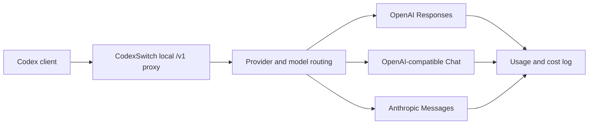

# CodexSwitch

[English](README.md) | [简体中文](README.zh-CN.md)

[](https://github.com/AIDotNet/CodexSwitch/stargazers)
[](https://github.com/AIDotNet/CodexSwitch/actions/workflows/ci.yml)
[](https://dotnet.microsoft.com/)
[](https://avaloniaui.net/)

CodexSwitch is a cross-platform Avalonia desktop app that turns Codex into a local, switchable AI provider workstation. It runs an OpenAI Responses-compatible proxy on your machine, writes a managed Codex configuration, routes requests across multiple upstream providers, converts protocol dialects when needed, and keeps local usage and cost records.

The default local endpoint is:

```text
http://127.0.0.1:12785/v1
```

## What It Does

Codex talks to CodexSwitch as if it were an OpenAI Responses API endpoint. CodexSwitch then selects the right provider for the requested model, rewrites model and service-tier settings, converts requests and streaming responses for providers that use different APIs, and records token usage in a local JSONL log.



## Features

- Local proxy with `/health`, `/v1/models`, and `/v1/responses` endpoints.
- One-click active provider switching from the desktop UI.
- Built-in provider templates for RoutinAI, RoutinAI Plan, OpenAI Official, Anthropic Messages, DeepSeek, and Xiaomi MiMo.
- Dedicated Codex OAuth login flow for the ChatGPT Codex backend, including multi-account management.
- Custom provider support with configurable base URL, API key, protocol, model routes, upstream model names, and service tiers.
- Protocol adapters for OpenAI Responses, OpenAI-compatible Chat Completions, and Anthropic Messages.
- Streaming support with Responses-style SSE events where the upstream protocol allows it.
- Model routing by requested model, including aliases and upstream model remapping.
- Local model pricing catalog with tiered pricing, cache-read pricing, Claude cache-creation billing, and fast-mode multipliers.
- Usage dashboard with request logs, provider statistics, model statistics, 24-hour, 7-day, and 30-day trends.
- Managed Codex config and auth file writing with backup and restore support.
- Optional Codex App auth preservation so ChatGPT-login-only plugin features can stay available while routing through the local proxy.
- Light, dark, and system themes with localized UI resources.
- GitHub Release update checks with automatic system-specific installer downloads.

## Supported Protocols

| Provider protocol | Upstream endpoint | Notes |
| --- | --- | --- |
| `OpenAiResponses` | `/responses` | Passes Responses requests through with model, service-tier, and request override handling. |
| `OpenAiChat` | `/chat/completions` | Converts inbound Responses requests to Chat Completions and converts the result back to Responses shape. |
| `AnthropicMessages` | `/messages` | Converts inbound Responses requests to Anthropic Messages, including tool calls, thinking/reasoning mapping, and usage normalization where supported. |

CodexSwitch currently exposes Responses-style inbound routes. It does not expose `/v1/chat/completions` as a public inbound API.

## Built-In Providers

| Provider | Default protocol | Example default model |
| --- | --- | --- |
| RoutinAI | OpenAI Responses | `gpt-5.5` |
| RoutinAI Plan | OpenAI Responses | `gpt-5.5` |
| OpenAI Official | OpenAI Responses | `gpt-5.5` |
| Anthropic Messages | Anthropic Messages | `claude-sonnet-4-5` |
| DeepSeek | OpenAI Chat | `deepseek-v4-flash` |
| Xiaomi MiMo | OpenAI Chat | `mimo-v2.5-pro` |
| Codex OAuth | OpenAI Responses | `gpt-5.1-codex` |

You can add custom providers when an upstream service is OpenAI Responses-compatible, OpenAI Chat-compatible, or Anthropic Messages-compatible.

## Installation

Download published builds from [GitHub Releases](https://github.com/AIDotNet/CodexSwitch/releases) when release artifacts are available.

Current CI publish artifacts are Native AOT, self-contained packages:

- `CodexSwitch-vX.Y.Z-win-x64-setup.exe`
- `CodexSwitch-vX.Y.Z-linux-x64.AppImage`
- `CodexSwitch-vX.Y.Z-osx-arm64.dmg`

## Run From Source

Prerequisite: .NET SDK `10.0.203`, as pinned by `global.json`.

```powershell
git clone https://github.com/AIDotNet/CodexSwitch.git
cd CodexSwitch
dotnet restore CodexSwitch.Tests/CodexSwitch.Tests.csproj
dotnet run --project CodexSwitch/CodexSwitch.csproj
```

## First Run

1. Open CodexSwitch.
2. Choose a built-in provider template or create a custom provider.
3. Add the provider API key, or use the Codex OAuth login button for the Codex OAuth provider.
4. Set the provider as active.
5. Keep the local proxy enabled. Codex clients can use `http://127.0.0.1:12785/v1`.

When the proxy starts, CodexSwitch writes managed `.codex` and `.claude` files and keeps the originals as same-name `.bak` backups. When the proxy stops, the originals are restored from those `.bak` files.

If you need Codex App plugins, sign in to Codex App with ChatGPT first, then enable **Settings > Auth > Preserve Codex App ChatGPT login for plugins** before applying the proxy configuration. In that mode CodexSwitch still writes `config.toml`, but leaves the original `auth.json` login state in place.

## Local Files

CodexSwitch stores application state in the user's application data folder.

On Windows, the main files are:

| File | Purpose |
| --- | --- |
| `%APPDATA%\CodexSwitch\config.json` | Providers, routing, UI, proxy, OAuth account metadata, and local settings. |
| `%APPDATA%\CodexSwitch\model-pricing.json` | Editable pricing catalog used for cost estimates. |
| `%APPDATA%\CodexSwitch\usage-logs\yyyy\MM\usage-yyyy-MM-dd.jsonl` | Partitioned local request usage logs. |
| `%APPDATA%\CodexSwitch\icons\` | Cached provider and model icons. |
| `%USERPROFILE%\.codex\config.toml` | Managed Codex config while the proxy is enabled; the original file is kept as `config.toml.bak`. |
| `%USERPROFILE%\.codex\auth.json` | Managed Codex auth while the proxy is enabled, unless Codex App auth preservation is enabled; the original file is kept as `auth.json.bak`. |
| `%USERPROFILE%\.claude\settings.json` | Managed Claude Code settings while the proxy is enabled; the original file is kept as `settings.json.bak`. |

Treat the config files as sensitive because they can contain API keys and OAuth tokens.

## Development

Restore, build, and test:

```powershell
dotnet restore CodexSwitch.Tests/CodexSwitch.Tests.csproj
dotnet build CodexSwitch.Tests/CodexSwitch.Tests.csproj -c Release --no-restore
dotnet test CodexSwitch.Tests/CodexSwitch.Tests.csproj -c Release --no-build --no-restore
```

Publish a self-contained Native AOT build:

```powershell
dotnet publish CodexSwitch/CodexSwitch.csproj -c Release -r win-x64 --self-contained true -p:PublishAot=true
```

Validate the changelog before release work:

```powershell
./build/Validate-Changelog.ps1
```

## Project Structure

```text
CodexSwitch/
  Controls/        Reusable Avalonia controls
  I18n/            Runtime localization services and markup extension
  Models/          App config, provider, pricing, and usage models
  Proxy/           Local proxy host, routing, protocol adapters, payload builders
  Services/        Config storage, Codex config writing, usage, pricing, icons, updates
  Styles/          Avalonia theme and component styles
  ViewModels/      Main desktop application state and commands
  Views/           Windows, pages, dialogs, and shell components
CodexSwitch.Tests/ xUnit coverage for routing, pricing, config writing, usage, i18n, and updates
build/             Release and validation scripts
docs/              Release process notes
```

## CI and Release Flow

The `ci` workflow validates the changelog, restores packages, builds the test project, runs xUnit tests, and publishes Native AOT platform installers for Windows, Linux, and macOS runners. When the workflow runs on a `vX.Y.Z` tag, it also creates the GitHub Release and uploads the generated artifacts automatically. See [docs/release.md](docs/release.md).

## Current Scope

- The Claude Code page exists, but this build does not write Claude-specific local configuration yet.
- Keep the proxy host on `127.0.0.1` unless you intentionally want to expose it beyond your machine.
- Cost estimates depend on the local pricing catalog and should be treated as estimates, not billing statements.

## Contributing

Issues and pull requests are welcome. For changes that affect routing, protocol conversion, pricing, usage accounting, or config writing, please include focused tests in `CodexSwitch.Tests`.

Before opening a pull request:

```powershell
dotnet test CodexSwitch.Tests/CodexSwitch.Tests.csproj -c Release
./build/Validate-Changelog.ps1
```

## License

This repository does not currently declare a license. Add a `LICENSE` file before distributing the project as open-source software or accepting external contributions.

## Star History

[](https://www.star-history.com/#AIDotNet/CodexSwitch&Date)
