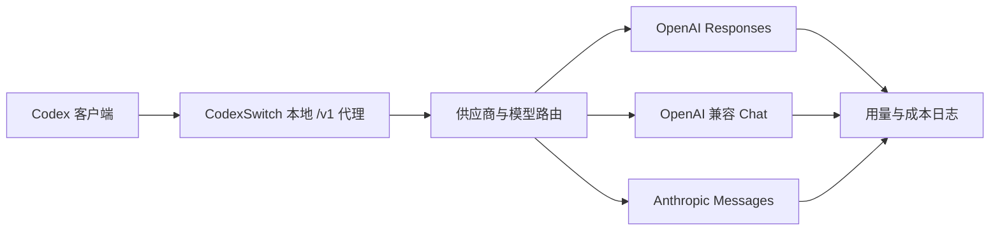

# CodexSwitch

[English](README.md) | [简体中文](README.zh-CN.md)

[](https://github.com/AIDotNet/CodexSwitch/stargazers)
[](https://github.com/AIDotNet/CodexSwitch/actions/workflows/ci.yml)
[](https://dotnet.microsoft.com/)
[](https://avaloniaui.net/)

CodexSwitch 是一个跨平台 Avalonia 桌面应用，用来把 Codex 变成一个可视化、可切换、可统计的本地 AI Provider 工作台。它会在本机运行一个兼容 OpenAI Responses 的代理服务，写入受管理的 Codex 配置，把请求路由到不同上游供应商，在需要时转换协议，并在本地记录 token 用量和成本估算。

默认本地端点是：

```text
http://127.0.0.1:12785/v1
```

## 它解决什么问题

Codex 会把 CodexSwitch 当成一个 OpenAI Responses API 端点来访问。CodexSwitch 收到请求后，会根据模型和路由配置选择供应商，重写模型名和 service tier，把请求转换成上游供应商需要的协议，再把响应和流式事件转换回 Responses 形态，同时把用量写入本地 JSONL 日志。



## 功能特性

- 本地代理服务，提供 `/health`、`/v1/models`、`/v1/responses` 端点。
- 在桌面界面中一键切换当前激活供应商。
- 内置 RoutinAI、RoutinAI Plan、OpenAI Official、Anthropic Messages、DeepSeek、Xiaomi MiMo 等供应商模板。
- 提供专门的 Codex OAuth 登录流程，可连接 ChatGPT Codex 后端，并支持多账号管理。
- 支持自定义供应商，可配置 base URL、API key、协议、模型路由、上游模型名和 service tier。
- 支持 OpenAI Responses、OpenAI 兼容 Chat Completions、Anthropic Messages 三类上游协议。
- 在上游协议允许时支持流式响应，并输出 Responses 风格的 SSE 事件。
- 按请求模型自动路由，支持模型别名和上游模型映射。
- 本地模型价格目录，支持阶梯价格、缓存读取价格、Claude 缓存创建计费和 fast mode 倍率。
- 用量仪表盘，包含请求日志、供应商统计、模型统计、24 小时、7 天、30 天趋势。
- 自动写入受管理的 Codex 配置和 auth 文件，并支持备份与恢复。
- 可选择保留 Codex App 的 ChatGPT 登录态，让依赖 ChatGPT 登录的插件能力在本地代理模式下继续可用。
- 支持浅色、深色、跟随系统主题，以及本地化 UI 资源。
- 应用内可检查 GitHub Release 更新，并自动下载适合当前系统的安装包。

## 支持的协议

| Provider 协议 | 上游端点 | 说明 |
| --- | --- | --- |
| `OpenAiResponses` | `/responses` | 直接转发 Responses 请求，并处理模型、service tier 和请求覆盖配置。 |
| `OpenAiChat` | `/chat/completions` | 把入站 Responses 请求转换成 Chat Completions，再把结果转换回 Responses 形态。 |
| `AnthropicMessages` | `/messages` | 把入站 Responses 请求转换成 Anthropic Messages，并在支持的范围内处理工具调用、thinking/reasoning 映射和用量归一化。 |

CodexSwitch 当前对外暴露的是 Responses 风格的入站接口，不提供 `/v1/chat/completions` 作为公开入站 API。

## 内置供应商

| 供应商 | 默认协议 | 默认模型示例 |
| --- | --- | --- |
| RoutinAI | OpenAI Responses | `gpt-5.5` |
| RoutinAI Plan | OpenAI Responses | `gpt-5.5` |
| OpenAI Official | OpenAI Responses | `gpt-5.5` |
| Anthropic Messages | Anthropic Messages | `claude-sonnet-4-5` |
| DeepSeek | OpenAI Chat | `deepseek-v4-flash` |
| Xiaomi MiMo | OpenAI Chat | `mimo-v2.5-pro` |
| Codex OAuth | OpenAI Responses | `gpt-5.1-codex` |

如果某个上游服务兼容 OpenAI Responses、OpenAI Chat 或 Anthropic Messages，也可以作为自定义供应商接入。

## 安装

当 Release 产物发布后，可以从 [GitHub Releases](https://github.com/AIDotNet/CodexSwitch/releases) 下载。

当前 CI 会发布这些 Native AOT、自包含安装产物：

- `CodexSwitch-vX.Y.Z-win-x64-setup.exe`
- `CodexSwitch-vX.Y.Z-linux-x64.AppImage`
- `CodexSwitch-vX.Y.Z-osx-arm64.dmg`

## 从源码运行

前置要求：`global.json` 中固定的 .NET SDK `10.0.203`。

```powershell
git clone https://github.com/AIDotNet/CodexSwitch.git
cd CodexSwitch
dotnet restore CodexSwitch.Tests/CodexSwitch.Tests.csproj
dotnet run --project CodexSwitch/CodexSwitch.csproj
```

## 首次使用

1. 打开 CodexSwitch。
2. 选择一个内置供应商模板，或创建自定义供应商。
3. 填入供应商 API key；如果使用 Codex OAuth 供应商，则点击 Codex OAuth 登录按钮。
4. 将供应商设置为当前激活。
5. 保持本地代理启用。Codex 客户端可以使用 `http://127.0.0.1:12785/v1`。

代理启动时，CodexSwitch 会写入受管理的 `.codex` 和 `.claude` 文件，并把原始文件保留为同名 `.bak` 备份。代理停止时，会从这些 `.bak` 文件恢复原始内容。

如果需要使用 Codex App 插件，请先在 Codex App 中用 ChatGPT 登录，然后在 **设置 > 认证 > 保留 Codex App 的 ChatGPT 登录以支持插件** 中打开该选项，再应用代理配置。此模式下 CodexSwitch 仍会写入 `config.toml`，但会保留原来的 `auth.json` 登录态。

## 本地文件

CodexSwitch 会把应用状态保存在用户的应用数据目录中。

在 Windows 上，主要文件包括：

| 文件 | 用途 |
| --- | --- |
| `%APPDATA%\CodexSwitch\config.json` | 供应商、路由、UI、代理、OAuth 账号元数据和本地设置。 |
| `%APPDATA%\CodexSwitch\model-pricing.json` | 可编辑的模型价格目录，用于成本估算。 |
| `%APPDATA%\CodexSwitch\usage-logs\yyyy\MM\usage-yyyy-MM-dd.jsonl` | 按日期分片的本地请求用量日志。 |
| `%APPDATA%\CodexSwitch\icons\` | 缓存的供应商和模型图标。 |
| `%USERPROFILE%\.codex\config.toml` | 代理启用时写入的受管理 Codex 配置；原始文件会保留为 `config.toml.bak`。 |
| `%USERPROFILE%\.codex\auth.json` | 代理启用时写入的受管理 Codex auth 文件；开启 Codex App 登录态保留时不会覆盖，原始文件会保留为 `auth.json.bak`。 |
| `%USERPROFILE%\.claude\settings.json` | 代理启用时写入的受管理 Claude Code 配置；原始文件会保留为 `settings.json.bak`。 |

这些配置文件可能包含 API key 和 OAuth token，请按敏感文件处理。

## 开发

还原、构建和测试：

```powershell
dotnet restore CodexSwitch.Tests/CodexSwitch.Tests.csproj
dotnet build CodexSwitch.Tests/CodexSwitch.Tests.csproj -c Release --no-restore
dotnet test CodexSwitch.Tests/CodexSwitch.Tests.csproj -c Release --no-build --no-restore
```

发布一个 Native AOT 自包含构建：

```powershell
dotnet publish CodexSwitch/CodexSwitch.csproj -c Release -r win-x64 --self-contained true -p:PublishAot=true
```

发布前验证 changelog：

```powershell
./build/Validate-Changelog.ps1
```

## 项目结构

```text
CodexSwitch/
  Controls/        可复用 Avalonia 控件
  I18n/            运行时本地化服务和 markup extension
  Models/          应用配置、供应商、价格和用量模型
  Proxy/           本地代理、路由、协议适配器、payload 构建器
  Services/        配置存储、Codex 配置写入、用量、价格、图标、更新检查
  Styles/          Avalonia 主题和组件样式
  ViewModels/      桌面应用主状态和命令
  Views/           窗口、页面、弹窗和 shell 组件
CodexSwitch.Tests/ xUnit 测试，覆盖路由、价格、配置写入、用量、i18n 和更新检查
build/             发布和验证脚本
docs/              发布流程说明
```

## CI 与发布流程

`ci` 工作流会验证 changelog、还原依赖、构建测试项目、运行 xUnit 测试，并为 Windows、Linux、macOS runner 发布 Native AOT 平台安装产物。当前当工作流在 `vX.Y.Z` 标签上运行时，也会自动创建 GitHub Release 并上传生成的产物。详情见 [docs/release.md](docs/release.md)。

## 当前范围

- Claude Code 页面已经存在，但当前版本尚未写入 Claude 专用本地配置。
- 除非明确需要对外暴露，否则建议保持代理 host 为 `127.0.0.1`。
- 成本统计依赖本地价格目录，应视为估算值，而不是正式账单。

## 贡献

欢迎提交 issue 和 pull request。涉及路由、协议转换、价格计算、用量统计或配置写入的改动，请在 `CodexSwitch.Tests` 中补充聚焦测试。

提交 pull request 前建议运行：

```powershell
dotnet test CodexSwitch.Tests/CodexSwitch.Tests.csproj -c Release
./build/Validate-Changelog.ps1
```

## 许可证

当前仓库尚未声明许可证。正式以开源项目分发或接受外部贡献前，建议先添加 `LICENSE` 文件。

## Star 趋势

[](https://www.star-history.com/#AIDotNet/CodexSwitch&Date)
