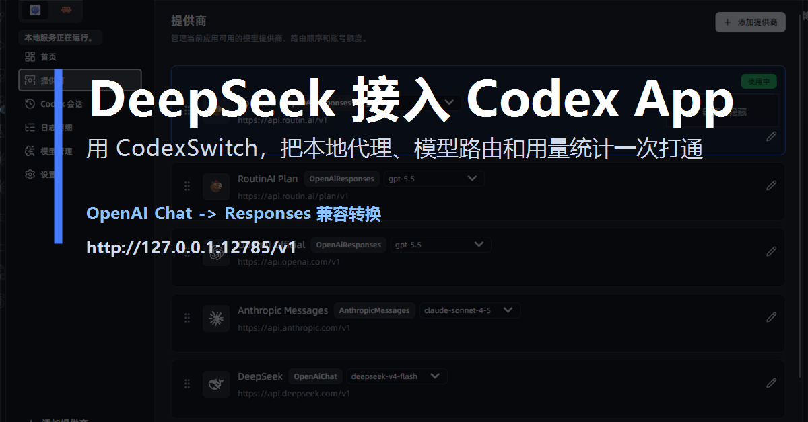
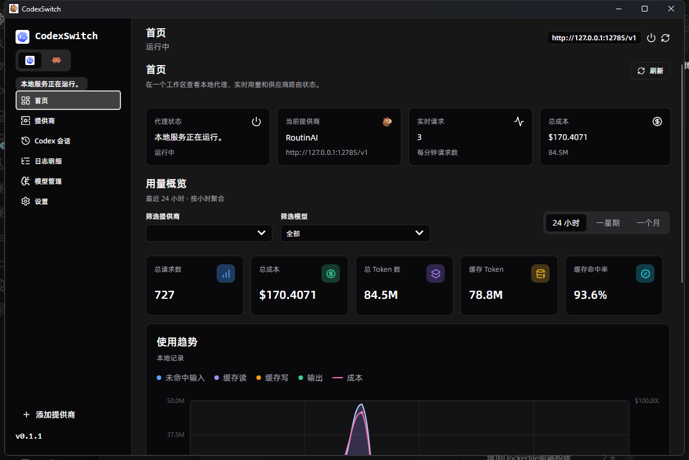
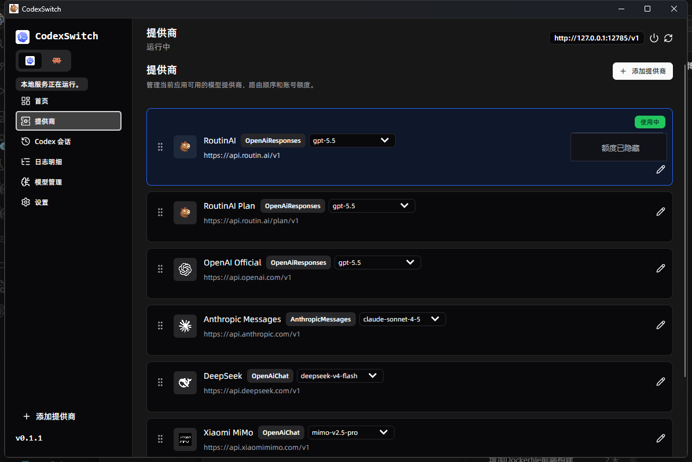
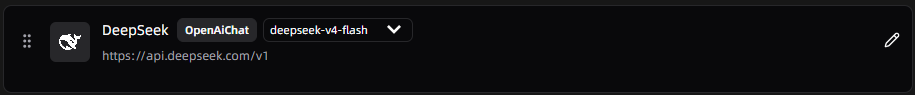
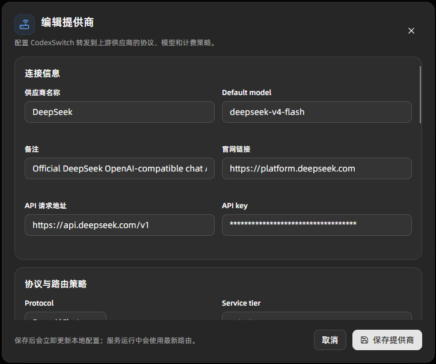

# 把 DeepSeek 装进 Codex App：用 CodexSwitch 打通本地 AI Provider 工作台

> 公众号发布建议：封面使用 `docs/wechat-assets/wechat-cover-deepseek-codexswitch.png`；正文图片按文中顺序上传。本文截图来自本机运行中的 CodexSwitch，余额与密钥信息已隐藏。



如果你已经习惯了在 Codex App 里让 AI 帮你读代码、跑命令、改工程文件，下一步很自然的问题就是：能不能把更多模型接进来，比如 DeepSeek？

答案是可以。关键不是让 Codex App 直接适配每一家模型厂商，而是在本机放一个足够聪明的中间层：CodexSwitch。

CodexSwitch 会在电脑上启动一个本地代理端点：

```text
http://127.0.0.1:12785/v1
```

Codex App 只需要像访问 OpenAI Responses API 一样访问这个本地端点；真正到上游时，CodexSwitch 再把请求路由到 DeepSeek，并完成协议转换、模型映射、流式输出转换和本地用量统计。

简单说：

```text
Codex App -> CodexSwitch 本地代理 -> DeepSeek OpenAI 兼容接口
```

这样，Codex App 的使用体验不变，但底层模型可以切换到 DeepSeek。

## 为什么需要 CodexSwitch？

很多模型服务都兼容 OpenAI Chat Completions，但 Codex App 的工作方式更接近 Responses 风格。两边并不是完全同一种协议。

CodexSwitch 做的事情，就是把这层差异收起来：

- Codex App 继续使用本地 Responses 风格入口；
- DeepSeek 继续使用自己的 OpenAI 兼容 Chat 接口；
- CodexSwitch 在中间做模型路由、请求转换和流式事件转换；
- 每次请求的 token、成本估算、供应商统计都会落到本地仪表盘。

对于日常开发来说，这个体验会非常顺：不用反复改 Codex 配置，也不用在不同模型客户端之间来回切。

## 第一步：启动 CodexSwitch

打开 CodexSwitch 后，左侧可以看到本地服务状态，右上角会显示当前本地端点。只要看到服务正在运行，Codex App 就可以访问这个本地代理。



首页除了服务状态，还会展示实时请求数、总成本、token 统计和趋势图。对于经常跑大型仓库分析、长上下文任务的人来说，这个本地用量面板很实用：你可以直观看到到底是哪一个模型、哪一次请求消耗得最多。

## 第二步：选择 DeepSeek 提供商

CodexSwitch 内置了 DeepSeek 模板。进入「提供商」页面，可以直接看到 DeepSeek 这一项，协议显示为 `OpenAiChat`，默认模型示例为 `deepseek-v4-flash`，API 请求地址是：

```text
https://api.deepseek.com/v1
```



如果只想确认 DeepSeek 是否已经在列表里，也可以看这一行：



## 第三步：填入 DeepSeek API Key

点击 DeepSeek 右侧的编辑按钮，进入提供商配置页。这里主要确认四件事：

- 供应商名称：DeepSeek；
- Default model：按你的 DeepSeek 平台可用模型填写；
- API 请求地址：`https://api.deepseek.com/v1`；
- API key：填入你自己的 DeepSeek API Key。



保存后，CodexSwitch 会立即更新本地配置。只要把 DeepSeek 设置为当前使用中的提供商，后续 Codex App 发来的请求就会由 CodexSwitch 转发到 DeepSeek。

## 第四步：让 Codex App 使用本地代理

这一点是 CodexSwitch 最省心的地方：它会自动写入受管理的 Codex 配置，把 Codex App 的模型入口指向本机：

```text
http://127.0.0.1:12785/v1
```

也就是说，Codex App 仍然以熟悉的方式工作；只是它背后访问的模型提供商，已经由 CodexSwitch 接管。

如果你还依赖 Codex App 里的 ChatGPT 登录态或插件能力，可以先在 Codex App 中登录 ChatGPT，再到 CodexSwitch 设置里开启“保留 Codex App 的 ChatGPT 登录以支持插件”。这样 CodexSwitch 会继续管理 `config.toml`，但不会覆盖原来的 `auth.json` 登录态。

## 实际使用时是什么感觉？

最大的变化是：你不需要改变使用 Codex App 的习惯。

你仍然可以让 Codex App 做这些事：

- 分析一个仓库的代码结构；
- 修改某个模块；
- 跑测试、看失败原因；
- 做重构方案；
- 生成说明文档。

不同的是，模型请求会先进入 CodexSwitch，再由它转给 DeepSeek。你可以随时切回 OpenAI、Anthropic、RoutinAI 或其他自定义供应商，也可以在 CodexSwitch 的日志里追踪每次请求的成本和 token。

这对团队和个人开发者都很有价值：模型可以灵活切换，配置集中管理，用量也有迹可查。

## 适合谁用？

如果你有下面任意一种需求，CodexSwitch + DeepSeek 会很适合：

- 想在 Codex App 中尝试 DeepSeek，而不是换一个全新的开发工具；
- 希望不同模型供应商之间可以一键切换；
- 想把模型调用、成本估算、用量趋势放在一个本地面板里；
- 需要同时维护 Codex App 配置和多家模型 API Key；
- 经常处理大仓库，希望把模型选择变成一个可控的工作流。

## 一句话总结

CodexSwitch 让 Codex App 不再绑定单一模型入口。

你可以继续使用熟悉的 Codex App 工作流，同时把 DeepSeek 作为上游模型接入进来：本地代理负责协议转换，提供商页面负责模型切换，仪表盘负责用量统计。

对于想把 DeepSeek 带进真实开发工作流的人来说，这不是“再装一个聊天窗口”，而是把 DeepSeek 接到 Codex App 的工程化入口上。

项目地址：

```text
https://github.com/AIDotNet/CodexSwitch
```

如果你正在用 Codex App 做代码开发，不妨试试 CodexSwitch：把 DeepSeek、OpenAI、Anthropic 等模型放进同一个本地工作台，让模型选择真正变成开发流程的一部分。
